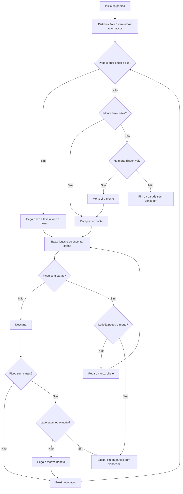

# **Regras Oficiais do Jogo de Tranca**
### *Documento técnico para implementação digital*

> Esta é a **especificação final** usada pelo motor de regras. Cada regra tem um número de seção (ex.: `§5.4`), que deve ser citado nos testes automatizados que a verificam.

---

## 📌 **1. Componentes do Jogo**

- O jogo utiliza **2 baralhos padrão**, sem curingas de fábrica (total de **104 cartas**).
- Cada baralho contém cartas de **2 a 10**, **Valete (J)**, **Dama (Q)**, **Rei (K)** e **Ás (A)**, nos quatro naipes tradicionais.
- As cartas são embaralhadas aleatoriamente no início de cada partida, formando **um único monte**.

### **1.1. Lados**
- **Modo individual:** 2 jogadores (humano × máquina). Cada jogador é um **lado**.
- **Modo duplas:** 4 jogadores (humano + parceiro virtual × dupla virtual). Cada dupla é um **lado**; os parceiros sentam em posições opostas.
- Neste documento, **"lado"** significa o jogador (modo individual) ou a dupla (modo duplas).

---

## 📌 **2. Estrutura do Jogo**

- O jogo é composto por **múltiplas partidas**.
- O vencedor do jogo é o lado que atingir a **pontuação-alvo** (ver §14), padrão **3.000 pontos**, com a maior pontuação.

---

# **3. Distribuição das Cartas**

### **3.1. Mão dos jogadores**
- Cada jogador recebe **11 cartas**, distribuídas uma por vez, em ordem.

### **3.2. Mortos**
- São formados **2 mortos**, cada um com **11 cartas**.
- Os mortos são distribuídos **depois das mãos**, **uma carta por vez para cada morto, alternadamente** (1ª carta para o 1º morto, 2ª para o 2º morto, 3ª para o 1º morto…), até que cada morto tenha 11 cartas.
- Os mortos ficam na mesa como **dois montes separados**, com as cartas **viradas para baixo**: todos sabem que eles existem, mas ninguém pode ver suas cartas até pegá-los.

### **3.3. Monte**
- As cartas restantes formam o **monte**, virado para baixo (60 cartas no modo individual, 38 no modo duplas).

### **3.4. Lixo inicial**
- O lixo começa **vazio**. O primeiro jogador, portanto, compra obrigatoriamente do monte.

### **3.5. Três vermelhos recebidos na distribuição**
- Após a distribuição, seguindo a ordem de jogada, cada jogador baixa automaticamente os 3 vermelhos recebidos e repõe cada um com uma carta do monte (ver §6.5).

---

# **4. Ordem de Jogada**

### **4.1. Primeiro jogador**
- O jogador inicial é escolhido aleatoriamente.

### **4.2. Sentido**
- A ordem de jogada segue **sentido horário**.

### **4.3. Estrutura de uma jogada**
Cada jogador, na sua vez, executa as ações na seguinte ordem:

1. **Comprar uma carta do monte**
   ou
   **Pegar o lixo**, se permitido (ver §5).

   São **alternativas exclusivas**, feitas **uma única vez**, no **início** da jogada: quem comprou do monte não pode pegar o lixo, e quem pegou o lixo não compra do monte. Nenhuma outra ação (baixar, acrescentar, descartar) pode ser feita antes desta etapa.

2. **Realizar qualquer ação, em qualquer ordem e quantas vezes quiser**, até descartar:
   - Baixar novos conjuntos.
   - Acrescentar cartas a conjuntos do seu lado já na mesa.

3. **Descartar uma carta**, finalizando sua jogada (ver §8), exceto quando bater baixando todas as cartas (ver §11).

> Os 3 vermelhos são baixados e repostos **automaticamente** sempre que entram na mão (ver §6.5); não são uma ação do jogador.

---

# **5. Regras do Lixo**

### **5.1. Condições para pegar o lixo**
O jogador **só pode pegar o lixo** se conseguir **levar imediatamente para a mesa** a **carta do topo** (a última descartada pelo jogador anterior), de uma das formas:

- **Formando um novo conjunto** com a carta do topo e **pelo menos 2 cartas da própria mão** (um coringa da mão pode ser usado, respeitando o limite de 1 coringa por conjunto); ou
- **Acrescentando** a carta do topo a um **conjunto do seu lado já na mesa**, sozinha ou junto com cartas da própria mão, desde que o acréscimo todo seja válido (ex.: com 4-5-6♥ na mesa e 8♥ no topo, o jogador pode acrescentar 7♥ da mão e o 8♥ do topo juntos).

A carta do topo **não pode ir para a mão** e **não pode ser combinada com as demais cartas do lixo** para formar o conjunto. As "cartas da própria mão" são as que o jogador já tinha **antes de pegar o lixo**; as demais cartas do lixo só chegam à mão depois que o topo foi levado à mesa (§5.2).

### **5.2. Conteúdo do lixo**
Ao pegar o lixo de forma válida:

- O jogador recebe **todas as demais cartas do lixo**, que vão para a **mão**.
- A partir daí, essas cartas podem ser usadas normalmente na mesma jogada.

### **5.3. Travamento do lixo (3 preto)**
- Se o topo do lixo for um **3 preto**, ele **não pode ser levado à mesa**.
- Portanto, o lixo fica **travado** para o próximo jogador, que **não pode pegar o lixo** e deve **comprar do monte**.
- Depois que esse jogador descartar, o próximo pode pegar o lixo normalmente (se puder levar o novo topo à mesa), e o 3 preto vai para a mão junto com as demais cartas.

### **5.4. Coringa no topo**
- Se o topo do lixo for um **coringa (2)**, o lixo **pode ser pego** normalmente, seguindo §5.1, §5.2 e todas as regras de conjuntos com coringa (§6.3):
  - **Conjunto novo:** o coringa do topo com **pelo menos 2 cartas naturais da mão** (como o conjunto só pode ter 1 coringa, as cartas da mão não podem incluir outro coringa); ou
  - **Acréscimo:** o coringa do topo a um conjunto do seu lado **que ainda não tenha coringa**, sozinho ou junto com cartas da mão. Se o conjunto for uma canastra limpa, ela passa a ser **suja**.
- O jogador leva **todas as demais cartas do lixo** para a mão (§5.2).
- Pegar ou não esse lixo, sabendo que o coringa pode sujar um jogo limpo, é decisão de estratégia do jogador.

### **5.5. Lixo vazio**
- Não é possível pegar o lixo quando ele está vazio.

### **5.6. Visibilidade**
- O lixo é **aberto**: todas as cartas que o compõem ficam visíveis a todos os jogadores (humanos e virtuais).

---

# **6. Formação de Conjuntos**

### **6.1. Tipos de conjuntos**
Um conjunto pode ser:

- **Sequência** de cartas consecutivas do mesmo naipe.
- **Grupo** de cartas do mesmo número (naipes quaisquer, repetições permitidas).

### **6.2. Regras gerais**
- Conjuntos devem ter **mínimo de 3 cartas**.
- **Nenhum 3** pode compor conjuntos.
- **Ás não é circular** e vale somente como carta alta:
  - Não existe A-2-3.
  - Não existe sequência que passe do Ás para o 2.
  - A sequência mais longa possível é **4-5-6-7-8-9-10-J-Q-K-A**.
- Cartas baixadas **não podem voltar à mão**.

### **6.3. Coringa (2)**
- O **2 é sempre coringa**; nunca é usado como carta natural. Não existe grupo de 2.
- O coringa substitui qualquer carta, em qualquer posição de uma sequência ou grupo.
- **Máximo de 1 coringa por conjunto**. Todo conjunto tem, portanto, pelo menos 2 cartas naturais.
- **Posição do coringa na sequência:** é definida pelo jogo, não pelo jogador. Se o coringa estiver preenchendo um buraco entre cartas naturais (ex.: 5-2-7), ele ocupa o buraco. Caso contrário, ocupa a **ponta de cima** (ex.: 5-6-2 → o coringa vale 7); se não couber em cima (a sequência já chega ao Ás), ocupa a **ponta de baixo**.
- **Coringa que "corre":** quando a carta natural correspondente à posição do coringa em uma sequência é baixada, o coringa é movido para uma das pontas da sequência, seguindo a mesma preferência (ponta de cima; se não couber, ponta de baixo), desde que caiba (respeitando §6.2). Se não couber em nenhuma ponta, a carta natural **não pode** ser baixada nessa sequência. O conjunto continua com coringa.
- Um coringa **pode** ser acrescentado a uma **canastra limpa** (respeitando o máximo de 1 coringa); ela passa a ser **suja** (§7.2). Sujar ou não uma canastra limpa é decisão de estratégia do jogador, não uma restrição da regra.

### **6.4. Conjuntos na mesa**
- Os conjuntos pertencem ao **lado**. No modo duplas, os parceiros compartilham os conjuntos e podem acrescentar cartas aos jogos um do outro.
- Cada lado pode ter **no máximo um grupo de cada número** na mesa.
- Um lado pode ter **mais de uma sequência do mesmo naipe**, desde que, ao ser **criada**, a nova sequência **não seja continuação** de uma sequência do mesmo naipe já na mesa. É continuação quando **todas as cartas da sequência nova poderiam ser acrescentadas, de uma vez, a uma sequência do mesmo naipe já na mesa do lado** (respeitando §6.2 e §6.3); nesse caso, as cartas devem ser acrescentadas à existente. **Exceção:** nessa verificação não se considera acrescentar o coringa da sequência nova a uma **canastra limpa**, porque sujá-la ou não é escolha de estratégia do jogador (§6.3); a nova sequência com coringa pode, então, ser baixada como conjunto separado. Exemplos, com 4-5-6♥ na mesa:
  - 7-8-9♥ como conjunto novo: **proibido** (cabe na existente).
  - 8♥-9♥-2 como conjunto novo: **proibido** (cabe como 4-5-6-2-8-9, com o coringa valendo 7).
  - 8-9-10♥ como conjunto novo: **permitido** (falta o 7, não cabe).
  - 6♥'-7♥-8♥ (6 do 2º baralho) como conjunto novo: **permitido** (o 6 se repetiria, não cabe).
  - Com a canastra limpa 4…9♥ na mesa, 10♥-J♥-2 como conjunto novo: **permitido** (pela exceção acima; o jogador também pode, se preferir, acrescentar as cartas à canastra, que passa a ser suja).
  - Com a canastra limpa 4…9♥ na mesa, 10♥-J♥-Q♥ como conjunto novo: **proibido** (cabe na canastra sem sujá-la).
- **Sequências na mesa nunca se unem.** Ao acrescentar cartas, o jogador **indica em qual conjunto** elas entram. Se uma carta servir para mais de um conjunto (ex.: com 4-5-6♥ e 8-9-10♥ na mesa, o 7♥ pode prolongar qualquer um dos dois), o jogador escolhe o conjunto; as duas sequências continuam separadas, mesmo que passem a ficar encostadas.

### **6.5. Três vermelhos**
- **3 vermelho (copas ou ouros)**:
  - É baixado **automaticamente**, sozinho, sempre que entra na mão (distribuição, compra do monte, morto ou reposição).
  - Vale **100 pontos** na mesa.
  - Ao ser baixado, o jogador recebe **uma carta do monte** como reposição. Se a reposição também for 3 vermelho, o processo se repete (**reposição em cadeia**).
  - Se o monte estiver vazio, a reposição segue §10. Se não houver monte nem morto, o 3 vermelho é baixado **sem reposição**.
  - **Não pode ser descartado.**
- Baixar um 3 vermelho não conta como "baixar conjunto" e não altera as regras de morto e batida.

### **6.6. Três pretos**
- **3 preto (espadas ou paus)**:
  - Não pode ser baixado.
  - Pode ser descartado; se descartado, **trava o lixo** para o próximo jogador (ver §5.3).

---

# **7. Canastras**

### **7.1. Definição**
- Conjunto com **6 ou mais cartas**.

### **7.2. Tipos**
- **Canastra limpa**: sem coringa → **+200 pontos**
- **Canastra suja**: com coringa → **+100 pontos**

### **7.3. Crescimento**
- Uma canastra pode continuar recebendo cartas naturais.
- Uma canastra limpa pode receber coringa e passa a ser **suja** (ver §6.3).

---

# **8. Descarte**

- Toda jogada termina com **exatamente um descarte**, exceto a batida feita baixando todas as cartas (ver §11).
- Qualquer carta pode ser descartada, **exceto o 3 vermelho**. Coringas e 3 pretos podem ser descartados.
- A carta do topo do lixo que o jogador pegou nesta jogada vai obrigatoriamente para a mesa e, portanto, não pode ser descartada.
- **Ficar sem cartas é restrito:** o jogador só pode ficar com a mão vazia (baixando tudo ou descartando a última carta) se isso resultar em **pegar o morto** (§9) ou em **batida** (§11). Nos demais casos, a jogada é ilegal.
- **Manter cartas para descartar:** quando ficar sem cartas não for permitido, as jogadas de baixar conjuntos, acrescentar cartas e pegar o lixo devem deixar **pelo menos 2 cartas na mão** (uma para descartar e outra que permanece). Ex.: sem morto disponível e sem canastra, um jogador com 3 cartas não pode baixar 2 delas.
- **Última carta sem reposição:** se o jogador ficar com apenas 1 carta porque um 3 vermelho comprado não pôde ser reposto (sem monte e sem morto, §6.5/§10) e não puder bater descartando essa carta, a **partida termina sem vencedor** (§11.2).

---

# **9. Mortos**

### **9.1. Direito ao morto**
- Cada lado pode pegar **no máximo um morto** por partida.
- No modo duplas, o morto é pego pelo **primeiro jogador da dupla** que ficar sem cartas; o parceiro não pega outro.
- Um morto só está **disponível** enquanto não tiver sido pego por nenhum lado nem transformado em monte (§10).

### **9.2. Morto direto**
- Se o jogador **baixar todas as cartas da mão** durante a jogada (antes do descarte), seu lado ainda não tiver morto e houver morto disponível:
  - O jogador pega o morto **imediatamente** e **continua jogando** (volta à etapa 2 de §4.3), podendo baixar cartas e conjuntos antes de descartar.
  - Pode inclusive **bater na mesma jogada**, se cumprir §11.

### **9.3. Morto indireto**
- Se o jogador **descartar a última carta da mão**, seu lado ainda não tiver morto e houver morto disponível:
  - O jogador pega o morto e **joga com ele somente na sua próxima vez**.

### **9.4. 3 vermelhos no morto**
- Os 3 vermelhos que vierem no morto são baixados e repostos automaticamente (§6.5).

### **9.5. Sem morto disponível**
- Se o lado ainda não pegou morto e **não há morto disponível**, o jogador **não pode ficar sem cartas** (§8).

---

# **10. Monte Esgotado**

Quando for necessário comprar do monte (compra da jogada ou reposição de 3 vermelho) e ele estiver vazio:

1. Se houver **morto disponível**, ele se torna o **novo monte** (se houver dois, apenas um deles; o outro continua disponível como morto).
2. Se não houver morto disponível:
   - **Reposição de 3 vermelho:** o 3 vermelho fica sem reposição.
   - **Compra da jogada:** o jogador pode pegar o lixo, se for permitido (§5). Caso não possa ou não queira, a **partida termina sem vencedor**.

---

# **11. Batida e Fim da Partida**

### **11.1. Condições para bater**
O jogador bate, encerrando a partida com vitória do seu lado, quando:

1. Seu **lado já pegou o morto** (no modo duplas, vale o morto pego por qualquer um dos parceiros);
2. Seu **lado tem pelo menos uma canastra** na mesa (limpa ou suja); e
3. O jogador fica **sem cartas na mão**, de uma das formas:
   - **baixando todas as cartas** (sem descarte); ou
   - **descartando a última carta**.

### **11.2. Fim sem vencedor**
A partida termina sem vencedor apenas nos casos de:
- §10: monte esgotado, sem morto disponível e sem possibilidade de pegar o lixo (ou o jogador não quer pegá-lo);
- §8: jogador com apenas 1 carta após 3 vermelho sem reposição, sem poder bater.

---

# **12. Pontuação da Partida**

Ao final de cada partida (com ou sem vencedor), cada lado soma:

### **12.1. Pontos na mesa (positivos)**
- **3 vermelho**: +100 cada
- **Canastra limpa**: +200 cada
- **Canastra suja**: +100 cada
- **Batida**: +100 (somente o lado vencedor; não se aplica a partidas sem vencedor)
- Cartas em conjuntos (canastras ou não) **não têm valor próprio**: valem apenas os bônus acima.

### **12.2. Penalidades (negativas)**
- **Morto não pego**: –100 para cada lado que terminar a partida sem ter pego um morto.
- **Cartas na mão**, de todos os jogadores do lado:
  - **3 vermelho**: –5
  - **3 preto**: –5
  - **4 a 10**: –8
  - **J, Q, K, A**: –10
  - **Coringa (2)**: –10

### **12.3. Pontuação em duplas**
- Os pontos dos dois parceiros são **somados** no total da dupla.

---

# **13. Condições de Vitória do Jogo**

- Ao final de cada partida, se algum lado tiver pontuação total **maior ou igual (≥)** à pontuação-alvo, o jogo termina.
- Se mais de um lado atingir a pontuação-alvo, vence quem tiver a **maior pontuação**.
- Se houver empate na maior pontuação, joga-se **nova partida** até desempatar.

---

# **14. Parâmetros Configuráveis**

Definidos pelo jogador **antes do início do jogo**; não mudam durante o jogo.

| Parâmetro | Valores | Padrão |
|---|---|---|
| Pontuação-alvo | número inteiro positivo | **3.000** |
| Modo | individual / duplas | — |
| Dificuldade dos jogadores virtuais | fácil / médio / difícil | médio |

Todas as demais regras deste documento são **fixas**. No código, elas ficam reunidas no `RuleSet` padrão (cartas por mão = 11, cartas por morto = 11, tamanho mínimo de canastra = 6, máximo de coringas por conjunto = 1, valores de pontuação), para facilitar ajustes futuros, mas não são expostas ao jogador.

---

# **15. Resumo do Fluxo de Jogo**

> O motor só permite ficar sem cartas quando o resultado é válido (§8): pegar um morto disponível ou bater com ao menos uma canastra. Por isso o fluxograma não tem caminhos de "sem cartas" ilegais.
