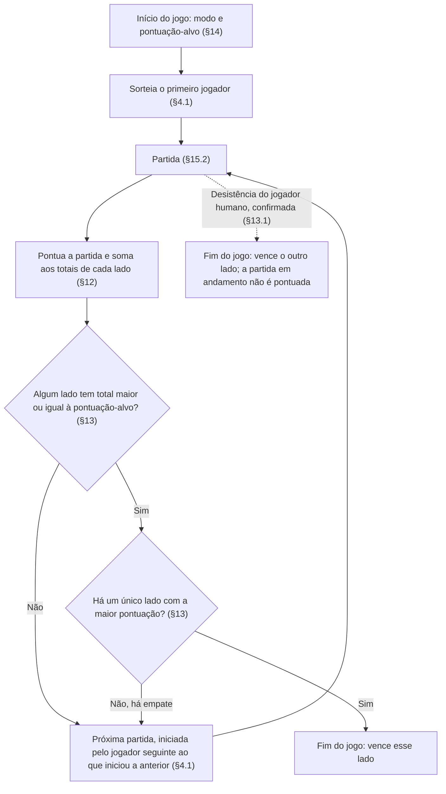
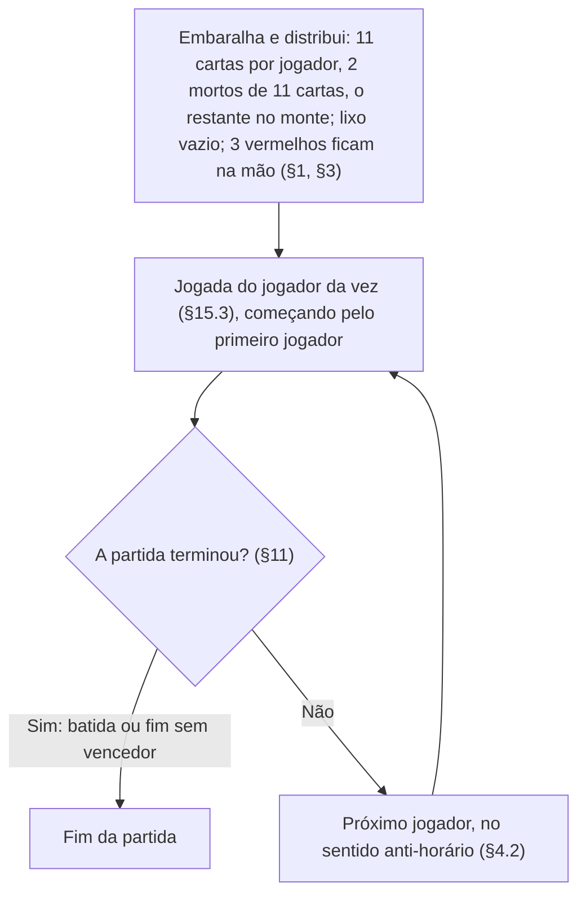
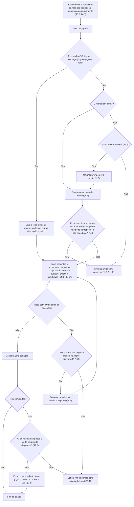

# **Regras Oficiais do Jogo de Tranca**
### *Documento técnico para implementação digital*

> Esta é a **especificação final** usada pelo motor de regras. Cada regra tem um número de seção (ex.: `§5.4`), que deve ser citado nos testes automatizados que a verificam.
>
> O documento descreve as **regras-base** (perfil **Clássica**). Os pontos que podem variar de uma mesa para outra são **parâmetros de regra**, marcados no texto como *(parâmetro `nome`; base: valor)*. A lista completa e os perfis que alteram esses valores estão em §14.2 e §14.3; tudo que não é parâmetro vale igual em qualquer perfil.

---

## 📌 **1. Componentes do Jogo**

- O jogo utiliza **2 baralhos padrão**, sem curingas de fábrica (total de **104 cartas**).
- Cada baralho contém cartas de **2 a 10**, **Valete (J)**, **Dama (Q)**, **Rei (K)** e **Ás (A)**, nos quatro naipes tradicionais.
- Com o parâmetro `maxWildsPerMeld` em **0** (§6.3, §14.2), os **oito 2** (coringas) **saem do jogo**: o baralho fica com **96 cartas**.
- As cartas são embaralhadas aleatoriamente no início de cada partida, formando **um único monte**.

### **1.1. Lados**
- **Modo individual:** 2 jogadores (humano × máquina). Cada jogador é um **lado**.
- **Modo duplas:** 4 jogadores (humano + parceiro virtual × dupla virtual). Cada dupla é um **lado**; os parceiros sentam em posições opostas.
- Neste documento, **"lado"** significa o jogador (modo individual) ou a dupla (modo duplas).
- No **multijogador local** (§16), os assentos de uma mesa podem ser ocupados por **jogadores humanos**, cada um no seu celular, e os demais por jogadores virtuais; os lados e as regras de jogo são exatamente os mesmos.

---

## 📌 **2. Estrutura do Jogo**

- O jogo é composto por **múltiplas partidas**.
- O vencedor do jogo é o lado que atingir a **pontuação-alvo** (ver §14), padrão **3.000 pontos**, com a maior pontuação.

---

# **3. Distribuição das Cartas**

### **3.1. Mão dos jogadores**
- Cada jogador recebe **11 cartas**, distribuídas uma por vez, em ordem.

### **3.2. Mortos**
- São formados **2 mortos**, cada um com **11 cartas**.
- Os mortos são distribuídos **depois das mãos**, **uma carta por vez para cada morto, alternadamente** (1ª carta para o 1º morto, 2ª para o 2º morto, 3ª para o 1º morto…), até que cada morto tenha 11 cartas.
- Os mortos ficam na mesa como **dois montes separados**, com as cartas **viradas para baixo**: todos sabem que eles existem, mas ninguém pode ver suas cartas até pegá-los.

### **3.3. Monte**
- As cartas restantes formam o **monte**, virado para baixo (60 cartas no modo individual, 38 no modo duplas; sem os 2, §1: 52 e 30). Nada sai do monte na distribuição: as reposições de 3 vermelho (§6.5) só começam na vez de cada jogador (§3.5).

### **3.4. Lixo inicial**
- O lixo começa **vazio**. O primeiro jogador, portanto, compra obrigatoriamente do monte.

### **3.5. Três vermelhos recebidos na distribuição**
- Os 3 vermelhos recebidos ficam **na mão** do jogador (só ele os vê). **Nada é trocado na distribuição.**
- Um 3 vermelho só pode ser trocado **na vez do jogador, nunca antes**. No **início de cada vez** (e, para o primeiro jogador, no início da sua primeira jogada), **antes de comprar**, todos os 3 vermelhos da mão são **baixados automaticamente** e **repostos imediatamente** com cartas do topo do monte, incluindo as reposições em cadeia (ver §6.5).
- Assim, cada jogador troca os seus 3 vermelhos apenas quando chega a sua vez: o 1º jogador antes da sua primeira compra, o seguinte (sentido anti-horário, §4.2) no início da sua primeira vez, e assim por diante.
- As trocas são **públicas**: todos os jogadores são avisados, na ordem em que aconteceram, de **quem** baixou cada 3 vermelho. As cartas recebidas como reposição continuam ocultas (vão para a mão de quem trocou).
- O registro público de trocas também diz, de cada 3 vermelho baixado, se ele chegou como **reposição em cadeia** (veio do monte durante a própria troca) ou se já estava na mão. É informação pública (todos veem o 3 vermelho baixado) e serve para a interface encenar a troca na ordem certa.
- **Encenação na interface (não muda regra):** quando um jogador baixa **dois ou mais** 3 vermelhos de uma vez (os da mão no início da vez, §3.5, ou os que vieram no morto, §9.4), a troca é mostrada **de uma só vez**: os 3 vermelhos saem juntos da mão (ou do morto) para a área dos 3 vermelhos do lado, a segunda carta um pouco depois da primeira, e em seguida as reposições saem juntas do monte para a mão, também com a segunda um pouco depois. Um 3 vermelho que chega como reposição em cadeia (§6.5) é uma troca seguinte. A troca do **próprio jogador** é só um **aviso**, como a dos demais jogadores (sem botões nem confirmação), e fecha sozinha.
- **Histórico da vez:** os 3 vermelhos que um jogador baixou na sua vez mais recente (no início dela ou durante a jogada, inclusive os do morto e as reposições em cadeia) aparecem **em primeiro lugar** no resumo da última jogada dele na pílula do jogador (símbolo ♥ com as cartas) e no detalhe que abre ao tocar no jogador, antes das demais ações da vez.

---

# **4. Ordem de Jogada**

### **4.1. Primeiro jogador**
- Na **primeira partida** do jogo, o jogador inicial é escolhido aleatoriamente.
- Nas partidas seguintes, depois que a partida anterior terminar (com ou sem vencedor) e seus pontos forem computados, a nova partida é iniciada pelo **próximo jogador, no sentido anti-horário (§4.2), depois do que iniciou a partida anterior**.

### **4.2. Sentido**
- A ordem de jogada segue **sentido anti-horário**: o próximo a jogar é o jogador **à direita** de quem acabou de jogar.
- Assim, cada jogador recebe o descarte do jogador **à sua esquerda** (que joga antes dele) e descarta para o jogador **à sua direita** (que joga depois dele).

### **4.3. Estrutura de uma jogada**
Cada jogador, na sua vez, executa as ações na seguinte ordem:

1. **Comprar uma carta do monte**
   ou
   **Pegar o lixo**, se permitido (ver §5).

   São **alternativas exclusivas**, feitas **uma única vez**, no **início** da jogada: quem comprou do monte não pode pegar o lixo, e quem pegou o lixo não compra do monte. Nenhuma outra ação (baixar, acrescentar, descartar) pode ser feita antes desta etapa.

2. **Realizar qualquer ação, em qualquer ordem e quantas vezes quiser**, até descartar:
   - Baixar novos conjuntos.
   - Acrescentar cartas a conjuntos do seu lado já na mesa.

3. **Descartar uma carta**, finalizando sua jogada (ver §8), exceto quando bater baixando todas as cartas (ver §11).

> Antes da etapa 1, no **início da vez**, os 3 vermelhos que o jogador tem na mão são baixados e repostos **automaticamente** (§3.5, §6.5). Os que chegam durante a jogada (compra do monte, morto direto, reposição) também são trocados na hora. A troca não é uma ação do jogador.

---

# **5. Regras do Lixo**

### **5.1. Condições para pegar o lixo**
O jogador **só pode pegar o lixo** se conseguir **levar imediatamente para a mesa** a **carta do topo** (a última descartada pelo jogador anterior), de uma das formas:

- **Formando um novo conjunto** com a carta do topo e **pelo menos 2 cartas da própria mão** (um coringa da mão pode ser usado, respeitando o limite de 1 coringa por conjunto); ou
- **Acrescentando** a carta do topo a um **conjunto do seu lado já na mesa**, sozinha ou junto com cartas da própria mão, desde que o acréscimo todo seja válido (ex.: com 4-5-6♥ na mesa e 8♥ no topo, o jogador pode acrescentar 7♥ da mão e o 8♥ do topo juntos).

A carta do topo **não pode ir para a mão** e **não pode ser combinada com as demais cartas do lixo** para formar o conjunto. As "cartas da própria mão" são as que o jogador já tinha **antes de pegar o lixo**; as demais cartas do lixo só chegam à mão depois que o topo foi levado à mesa (§5.2).

### **5.2. Conteúdo do lixo**
Ao pegar o lixo de forma válida:

- O jogador recebe **todas as demais cartas do lixo**, que vão para a **mão**.
- A partir daí, essas cartas podem ser usadas normalmente na mesma jogada.

### **5.3. Travamento do lixo (3 preto)**
- Se o topo do lixo for um **3 preto**, ele **não pode ser levado à mesa**.
- Portanto, o lixo fica **travado** para o próximo jogador, que **não pode pegar o lixo** e deve **comprar do monte**.
- Depois que esse jogador descartar, o próximo pode pegar o lixo normalmente (se puder levar o novo topo à mesa), e o 3 preto vai para a mão junto com as demais cartas.

### **5.4. Coringa no topo**
- Se o topo do lixo for um **coringa (2)**, o lixo **pode ser pego** normalmente, seguindo §5.1, §5.2 e todas as regras de conjuntos com coringa (§6.3):
  - **Conjunto novo:** o coringa do topo com **pelo menos 2 cartas naturais da mão** (como o conjunto só pode ter 1 coringa, as cartas da mão não podem incluir outro coringa); ou
  - **Acréscimo:** o coringa do topo a um conjunto do seu lado **que ainda não tenha coringa**, sozinho ou junto com cartas da mão. Se o conjunto for uma canastra limpa, ela passa a ser **suja**.
- O jogador leva **todas as demais cartas do lixo** para a mão (§5.2).
- Pegar ou não esse lixo, sabendo que o coringa pode sujar um jogo limpo, é decisão de estratégia do jogador.

### **5.5. Lixo vazio**
- Não é possível pegar o lixo quando ele está vazio.

### **5.6. Visibilidade**
- O lixo é **aberto**: todas as cartas que o compõem ficam visíveis a todos os jogadores (humanos e virtuais).
- No multijogador local (§16.4), o lixo inteiro é enviado a todos os celulares; as demais cartas ocultas (mãos dos outros, monte e mortos) nunca são.

---

# **6. Formação de Conjuntos**

### **6.1. Tipos de conjuntos**
Um conjunto pode ser:

- **Sequência** de cartas consecutivas do mesmo naipe.
- **Grupo** de cartas do mesmo número (naipes quaisquer, repetições permitidas). Os números que podem formar grupo são definidos pelo parâmetro `groupRanks` (base: **qualquer número**, de 4 a A); as opções estão em §14.2. Quando restrito, a restrição vale para todo grupo, inclusive o formado ao pegar o lixo (§5.1); o coringa continua podendo compor um grupo permitido (§6.3).

### **6.2. Regras gerais**
- Conjuntos devem ter **mínimo de 3 cartas**.
- **Nenhum 3** pode compor conjuntos.
- **Ás não é circular** e vale somente como carta alta:
  - Não existe A-2-3.
  - Não existe sequência que passe do Ás para o 2.
  - A sequência mais longa possível é **4-5-6-7-8-9-10-J-Q-K-A**.
- Cartas baixadas **não podem voltar à mão**.

### **6.3. Coringa (2)**
- O **2 é sempre coringa**; nunca é usado como carta natural. Não existe grupo de 2.
- O coringa substitui uma carta de uma sequência ou grupo (na sequência, conforme as situações abaixo).
- **Máximo de 1 coringa por conjunto** *(parâmetro `maxWildsPerMeld`; base: 1; opções 0 ou 1)*. Todo conjunto tem, portanto, pelo menos 2 cartas naturais. Com o parâmetro em **0**, não há coringa no jogo: os 2 saem do baralho (§1).
- **Posição do coringa na sequência:** é definida pelas cartas naturais do conjunto, nunca escolhida pelo jogador. Há três situações:
  - **Travado:** se falta exatamente um valor entre as cartas naturais, o coringa ocupa esse buraco e vale esse número. Ex.: em 5-2-7 o coringa vale 6; só se acrescentam cartas do 4 para baixo ou do 8 para cima.
  - **Solto:** se as cartas naturais não têm buraco, o coringa fica numa ponta **sem valor fixo** e pode servir em qualquer um dos lados. Ex.: em 6-7-2 o jogador pode acrescentar 8 (o coringa continua solto), 5 (continua solto), 5 e 4 (continua solto), apenas 4 (o coringa passa a valer 5 e fica travado) ou apenas 9 (o coringa passa a valer 8 e fica travado). Se a sequência já chega ao Ás (ex.: Q-K-A-2), o coringa só pode estar na ponta de baixo.
  - **Sem posição:** se as cartas naturais já formam a sequência completa 4-5-6-7-8-9-10-J-Q-K-A, o coringa permanece no conjunto sem representar nenhuma carta.
- **Coringa que "corre":** quando é baixada a carta natural do valor em que o coringa está travado, o buraco deixa de existir e o coringa volta a ficar **solto** (ou **sem posição**, se a sequência ficar completa). A carta natural é sempre aceita; o conjunto continua com coringa.
- Um coringa **pode** ser acrescentado a uma **canastra limpa** (respeitando o máximo de 1 coringa), inclusive à sequência completa 4…A; ela passa a ser **suja** (§7.2). Sujar ou não uma canastra limpa (por exemplo, para poder bater) é decisão de estratégia do jogador, não uma restrição da regra.
- No **grupo**, o coringa vale o número do grupo e não tem posição.

### **6.4. Conjuntos na mesa**
- Os conjuntos pertencem ao **lado**. No modo duplas, os parceiros compartilham os conjuntos e podem acrescentar cartas aos jogos um do outro.
- Um lado pode ter **mais de um grupo do mesmo número** na mesa, e pode criar um grupo novo mesmo que as cartas coubessem num grupo já existente. Manter um só grupo por número ou não é decisão de estratégia do jogador (ex.: abrir um segundo grupo para baixar um coringa que sobraria na mão).
- Um lado pode ter **mais de uma sequência do mesmo naipe**, desde que, ao ser **criada**, a nova sequência **não seja continuação** de uma sequência do mesmo naipe já na mesa. É continuação quando **todas as cartas da sequência nova poderiam ser acrescentadas, de uma vez, a uma sequência do mesmo naipe já na mesa do lado** (respeitando §6.2 e §6.3); nesse caso, as cartas devem ser acrescentadas à existente. **Exceções** (por estratégia do jogador, a nova sequência pode ser baixada como conjunto separado):
  - **Canastra limpa:** não se considera acrescentar o coringa da sequência nova a uma canastra limpa, porque sujá-la ou não é escolha do jogador (§6.3).
  - **Coringa da sequência existente:** não se considera mudar a situação do coringa da sequência que já está na mesa (§6.3). Se, para caber, o coringa dela teria de travar ou mudar de valor, não é continuação; se cabe com o coringa na mesma situação (continua solto, ou continua travado no mesmo valor), é continuação.

  Exemplos, com 4-5-6♥ na mesa:
  - 7-8-9♥ como conjunto novo: **proibido** (cabe na existente).
  - 8♥-9♥-2 como conjunto novo: **proibido** (cabe como 4-5-6-2-8-9, com o coringa valendo 7).
  - 8-9-10♥ como conjunto novo: **permitido** (falta o 7, não cabe).
  - 6♥'-7♥-8♥ (6 do 2º baralho) como conjunto novo: **permitido** (o 6 se repetiria, não cabe).
  - Com a canastra limpa 4…10♥ na mesa, J♥-Q♥-2 como conjunto novo: **permitido** (pela exceção acima; o jogador também pode, se preferir, acrescentar as cartas à canastra, que passa a ser suja).
  - Com a canastra limpa 4…10♥ na mesa, J♥-Q♥-K♥ como conjunto novo: **proibido** (cabe na canastra sem sujá-la).
  - Com 4-5-6-2♥ na mesa (coringa solto), 8♥-9♥-10♥ como conjunto novo: **permitido** (para caber, o coringa teria de travar no 7).
  - Com K-A-2♥ na mesa, 9♥-10♥-J♥ como conjunto novo: **permitido** (o coringa teria de travar na Q).
  - Com 4-5-6-2♥ na mesa (coringa solto), 7♥-8♥-9♥ como conjunto novo: **proibido** (cabe e o coringa continua solto).
  - Com 5-2-7♥ na mesa (coringa travado no 6), 8♥-9♥-10♥ como conjunto novo: **proibido** (cabe e o coringa continua travado no 6).
- **Sequências na mesa nunca se unem.** Ao acrescentar cartas, o jogador **indica em qual conjunto** elas entram. Se uma carta servir para mais de um conjunto (ex.: com 4-5-6♥ e 8-9-10♥ na mesa, o 7♥ pode prolongar qualquer um dos dois), o jogador escolhe o conjunto; as duas sequências continuam separadas, mesmo que passem a ficar encostadas.

### **6.5. Três vermelhos**
- **3 vermelho (copas ou ouros)**:
  - É baixado **automaticamente**, sozinho, **sempre na vez do jogador**: no início da vez, se já estava na mão (recebido na distribuição, §3.5, ou vindo do morto indireto, §9.4), ou na hora, durante a vez, se entra na mão pela compra do monte, pelo morto direto (§9.2) ou por reposição.
  - Vale **+100 ou –100 pontos** na mesa, conforme o lado tenha ou não canastra ao fim da partida, e soma ainda **+5** como carta na mesa (§12.1): no total, +105 ou –95.
  - Ao ser baixado, o jogador recebe **uma carta do monte** como reposição. Se a reposição também for 3 vermelho, o processo se repete (**reposição em cadeia**).
  - A troca é **pública**: todos são avisados de quem baixou o 3 vermelho e em que momento (no início da vez, §3.5, ou durante a jogada). A carta de reposição é oculta.
  - Se o monte estiver vazio, a reposição segue §10. Se não houver monte nem morto, o 3 vermelho é baixado **sem reposição**.
  - **Não pode ser descartado.**
- Baixar um 3 vermelho não conta como "baixar conjunto" e não altera as regras de morto e batida.

### **6.6. Três pretos**
- **3 preto (espadas ou paus)**:
  - Não pode ser baixado.
  - Pode ser descartado; se descartado, **trava o lixo** para o próximo jogador (ver §5.3).

---

# **7. Canastras**

### **7.1. Definição**
- Conjunto com **7 ou mais cartas**, limpa ou suja.

### **7.2. Tipos**
- **Canastra limpa**: sem coringa → **+200 pontos** *(parâmetro `cleanCanastaPoints`; base: 200)*
- **Canastra suja**: com coringa → **+100 pontos** *(parâmetro `dirtyCanastaPoints`; base: 100)*
- **Sem coringas** (§1): não existe canastra suja; toda canastra vale `cleanCanastaPoints` e é chamada apenas de **canastra** (a exigência de canastra limpa para bater, §11.1, não se aplica).

### **7.3. Crescimento**
- Uma canastra pode continuar recebendo cartas naturais.
- Uma canastra limpa pode receber coringa e passa a ser **suja** (ver §6.3).

---

# **8. Descarte**

- Toda jogada termina com **exatamente um descarte**, exceto a batida feita baixando todas as cartas (ver §11).
- Qualquer carta pode ser descartada, **exceto o 3 vermelho**. Coringas e 3 pretos podem ser descartados.
- A carta do topo do lixo que o jogador pegou nesta jogada vai obrigatoriamente para a mesa e, portanto, não pode ser descartada.
- **Ficar sem cartas é restrito:** o jogador só pode ficar com a mão vazia (baixando tudo ou descartando a última carta) se isso resultar em **pegar o morto** (§9) ou em **batida** (§11). Nos demais casos, a jogada é ilegal.
- **Manter cartas para descartar:** quando ficar sem cartas não for permitido, as jogadas de baixar conjuntos, acrescentar cartas e pegar o lixo devem deixar **pelo menos 2 cartas na mão** (uma para descartar e outra que permanece). Ex.: sem morto disponível e sem canastra, um jogador com 3 cartas não pode baixar 2 delas.
- **Última carta sem reposição:** se o jogador ficar com apenas 1 carta porque um 3 vermelho comprado não pôde ser reposto (sem monte e sem morto, §6.5/§10) e não puder bater descartando essa carta, a **partida termina sem vencedor** (§11.2).

---

# **9. Mortos**

### **9.1. Direito ao morto**
- Cada lado pode pegar **no máximo um morto** por partida.
- No modo duplas, o morto é pego pelo **primeiro jogador da dupla** que ficar sem cartas; o parceiro não pega outro.
- Um morto só está **disponível** enquanto não tiver sido pego por nenhum lado nem transformado em monte (§10).

### **9.2. Morto direto**
- Se o jogador **baixar todas as cartas da mão** durante a jogada (antes do descarte), seu lado ainda não tiver morto e houver morto disponível:
  - O jogador pega o morto **imediatamente** e **continua jogando** (volta à etapa 2 de §4.3), podendo baixar cartas e conjuntos antes de descartar.
  - Pode inclusive **bater na mesma jogada**, se cumprir §11.

### **9.3. Morto indireto**
- Se o jogador **descartar a última carta da mão**, seu lado ainda não tiver morto e houver morto disponível:
  - O jogador pega o morto e **joga com ele somente na sua próxima vez**.

### **9.4. 3 vermelhos no morto**
- No **morto direto** (§9.2), os 3 vermelhos que vierem no morto são baixados e repostos automaticamente, na hora (§6.5).
- No **morto indireto** (§9.3), eles ficam na mão e são baixados e repostos no **início da próxima vez** do jogador, como os recebidos na distribuição (§3.5).

### **9.5. Sem morto disponível**
- Se o lado ainda não pegou morto e **não há morto disponível** (os dois foram pegos pelo outro lado ou um deles virou monte, §10), o lado **pode bater sem ter pego o morto**, desde que cumpra o restante de §11.1 (a canastra exigida para bater). Vale nos dois modos (individual e duplas).
- A batida segue a pontuação normal (§12): o lado que bate ganha os **+100 da batida** (§12.1) e, por não ter pego morto, sofre os **–100 de morto não pego** (§12.2); um compensa o outro.
- Sem a canastra exigida para bater, o jogador **não pode ficar sem cartas** (§8), como antes.

---

# **10. Monte Esgotado**

**Morto vira monte assim que o monte acaba** *(com `mortoBecomesStock` = sim)*: o morto não espera a próxima compra.
- Se o monte ficar vazio durante uma jogada (compra da última carta ou reposição de 3 vermelho), o morto disponível vira o novo monte **assim que essa jogada termina**, com o descarte, antes da vez do próximo jogador.
- Se o monte ficar vazio no início da vez (reposição dos 3 vermelhos, §3.5), o morto vira monte **antes da compra** desse jogador.
- Se a partida terminar nessa jogada (batida), nada muda.

Quando for necessário comprar do monte (compra da jogada ou reposição de 3 vermelho) e ele estiver vazio:

1. Se houver **morto disponível**, ele se torna o **novo monte** (se houver dois, apenas um deles; o outro continua disponível como morto) *(parâmetro `mortoBecomesStock`; base: sim)*. Com o parâmetro em **não**, nenhum morto vira monte: segue-se direto o item 2, como se não houvesse morto disponível para isso (os mortos continuam disponíveis para serem pegos, §9).
2. Se não houver morto disponível (ou ele não puder virar monte, item 1):
   - **Reposição de 3 vermelho:** o 3 vermelho fica sem reposição.
   - **Compra da jogada:** o jogador pode pegar o lixo, se for permitido (§5). Caso não possa ou não queira, a **partida termina sem vencedor**.

---

# **11. Batida e Fim da Partida**

### **11.1. Condições para bater**
O jogador bate, encerrando a partida com vitória do seu lado, quando:

1. Seu **lado já pegou o morto** (no modo duplas, vale o morto pego por qualquer um dos parceiros) **ou não há mais morto disponível** (§9.5);
2. Seu **lado tem pelo menos uma canastra** na mesa (limpa ou suja) *(parâmetro `goOutRequiresCleanCanasta`; base: não)*. Com o parâmetro em **sim**, é preciso ter **pelo menos uma canastra limpa**; canastras sujas não permitem bater. Em todo o documento, "a canastra exigida para bater" refere-se a esta condição (inclusive em §8 e §9.5); e
3. O jogador fica **sem cartas na mão**, de uma das formas:
   - **baixando todas as cartas** (sem descarte); ou
   - **descartando a última carta**.

### **11.2. Fim sem vencedor**
A partida termina sem vencedor apenas nos casos de:
- §10: monte esgotado, sem morto disponível e sem possibilidade de pegar o lixo (ou o jogador não quer pegá-lo);
- §8: jogador com apenas 1 carta após 3 vermelho sem reposição, sem poder bater.

---

# **12. Pontuação da Partida**

Ao final de cada partida (com ou sem vencedor), cada lado soma:

### **12.1. Pontos na mesa**
- **3 vermelho** baixado na mesa: **+100** cada, **se o lado tiver pelo menos uma canastra (limpa ou suja) na mesa** ao fim da partida.
  - Se o lado **não tiver canastra** na mesa, cada 3 vermelho baixado vale **–100** (penalidade).
  - Vale com ou sem vencedor da partida.
- **Canastra limpa**: +200 cada
- **Canastra suja**: +100 cada
- **Batida**: +100 (somente o lado vencedor; não se aplica a partidas sem vencedor)
- **Cartas na mesa**: depois dos pontos especiais acima, **cada carta baixada na mesa** do lado soma o seu valor, com a mesma tabela das cartas na mão (§12.2), porém **positiva**:
  - **3 vermelho**: +5 (além do ±100 acima)
  - **4 a 10**: +8
  - **J, Q, K, A**: +10
  - **Coringa (2)**: +10
  - Não há 3 preto na mesa (nenhum 3 compõe conjuntos, §6.2).
  - Contam todas as cartas de todos os conjuntos do lado (canastras ou não) e os 3 vermelhos baixados, sempre (com ou sem vencedor, com ou sem canastra).
  - Exemplo: canastra limpa 4-5-6-7-8-9-10 de copas = 200 (canastra limpa) + 7 × 8 (cartas) = **256**.

### **12.2. Penalidades (negativas)**
- **Morto não pego**: –100 para cada lado que terminar a partida sem ter pego um morto — inclusive o lado que bate quando não havia mais morto disponível (§9.5).
- **Cartas na mão**, de todos os jogadores do lado:
  - **3 vermelho**: –5
  - **3 preto**: –5 *(parâmetro `handBlackThreePoints`; base: –5)*
  - **4 a 10**: –8
  - **J, Q, K, A**: –10
  - **Coringa (2)**: –10

### **12.3. Pontuação em duplas**
- Os pontos dos dois parceiros são **somados** no total da dupla.

---

# **13. Condições de Vitória do Jogo**

- Ao final de cada partida, se algum lado tiver pontuação total **maior ou igual (≥)** à pontuação-alvo, o jogo termina.
- Se mais de um lado atingir a pontuação-alvo, vence quem tiver a **maior pontuação**.
- Se houver empate na maior pontuação, joga-se **nova partida** até desempatar.

### **13.1. Desistência**
- Durante o jogo, o jogador humano pode **desistir**, depois de confirmar a decisão (se cancelar, o jogo continua exatamente como estava). A opção não é oferecida na tela de pontuação da partida (§12).
- Ao desistir, o jogo termina imediatamente e o **outro lado** (o jogador virtual ou a dupla adversária) é declarado **vencedor**. A partida em andamento não é pontuada. O jogador **perde a aposta** (§14.6).
- **Jogo em grupo (multijogador, §16):** o parágrafo acima vale só para o jogo contra jogadores virtuais (um humano). Na mesa multijogador de 4 posições, quem desiste **não encerra o jogo**: o assento fica **VAGO**, o jogador perde a aposta e o jogo segue para os demais até a vez desse assento, quando o anfitrião decide como seguir (§16.9). A exceção é o **1×1 entre dois humanos** (§16.3), onde não há robô para assumir: o outro humano é declarado **vencedor**, como acima.

---

# **14. Parâmetros Configuráveis**

Definidos **antes do início do jogo**, na criação da mesa (§14.4); não mudam durante o jogo.

| Parâmetro | Valores | Padrão |
|---|---|---|
| Perfil de regras | um perfil da casa (§14.3) ou personalizado | Clássica |
| Pontuação-alvo | número inteiro positivo | a do perfil (**3.000** nos perfis da casa) |
| Modo | individual / duplas | o último modo escolhido (individual na primeira vez) |
| Dificuldade dos jogadores virtuais | fácil / médio / difícil | médio |
| Aposta da mesa (§14.6) | 50, 100, 250 ou 500 moedas | 50 |

### **14.1. Perfis (apresentação; não alteram nenhuma regra)**

- O **jogador** define o próprio **perfil**, de forma simples: **nome** (até 16 caracteres; vazio = "Você") e **avatar**. O perfil vale para todos os jogos e é lembrado entre eles.
- O avatar do jogador é uma **foto pessoal** escolhida da galeria do aparelho ou, sem foto, um **medalhão com a inicial do nome** e uma **cor** à escolha entre as da paleta do app. A foto é recortada em círculo a partir do centro, reduzida e guardada **só no aparelho**; ela aparece em todos os lugares onde aparece o avatar do jogador. O jogador pode trocar ou remover a foto (volta a valer o medalhão).
- Os **adversários e o parceiro** (jogadores virtuais) **não são configurados pelo jogador**: são os **personagens** de §14.5, sorteados **ao formar a mesa** (§14.4), antes de o jogador escolhê-la, e são exatamente os que jogam ("Continuar" mostra os mesmos personagens).
- O jogador escolhe também a **cor do baralho** (o verso das cartas): **azul** (padrão), **verde** ou **vermelho**. Ela vale em todo o jogo (monte, mãos dos outros jogadores e cartas em voo) e é lembrada entre os jogos.
- Não existem gênero nem profissão nos perfis.
- A imagem e o nome do jogador (ou do personagem) aparecem de forma discreta na mesa e em **toda** comunicação do jogo: avisos, janelas de decisão, tela de pontos e declaração do vencedor.

### **14.2. Parâmetros de regra**

São os únicos pontos das regras que mudam de um perfil para outro. Cada um é citado na seção onde age.

| Parâmetro | Seção | Opções | Base (Clássica) |
|---|---|---|---|
| `groupRanks` — números que podem formar grupo | §6.1 | **qualquer número** (4 a A) / **só A, K, Q, J** / **nenhum** (grupos proibidos) | qualquer número |
| `maxWildsPerMeld` — máximo de coringas por conjunto | §1, §6.3 | 0 (sem coringas: os 2 saem do baralho) / 1 | 1 |
| `cleanCanastaPoints` — canastra limpa | §7.2, §12.1 | inteiro ≥ 0 | 200 |
| `dirtyCanastaPoints` — canastra suja | §7.2, §12.1 | inteiro ≥ 0 | 100 |
| `mortoBecomesStock` — morto vira monte quando o monte acaba | §10 | sim / não | sim |
| `goOutRequiresCleanCanasta` — bater exige canastra limpa | §11.1 | sim / não | não |
| `handBlackThreePoints` — cada 3 preto na mão no fim da partida | §12.2 | inteiro ≤ 0 | –5 |
| `targetScore` — pontuação-alvo | §13, §14 | inteiro > 0 | 3.000 |

- Um perfil com valor **fora das faixas** da tabela não pode ser salvo nem usado numa mesa. Qualquer combinação de valores dentro das faixas é válida (ex.: grupos proibidos e 0 coringas = só sequências naturais).
- Todas as demais regras deste documento são **fixas** em qualquer perfil (cartas por mão = 11, cartas por morto = 11, tamanho mínimo de conjunto = 3 e de canastra = 7, demais valores de pontuação etc.). No código, ficam no `RuleSet` com os valores-base e não são expostas ao jogador.

### **14.3. Perfis de regras**

- Um **perfil de regras** tem **identificador, nome, versão e perfil de origem**, e define um valor para cada parâmetro de §14.2.
- **Perfis da casa** (fornecidos pelo app), descritos pelas diferenças em relação à base:

| Parâmetro | Clássica (base) | Tranca Paulista |
|---|---|---|
| `groupRanks` | qualquer número | **só A, K, Q, J** (com ou sem coringa) |
| `maxWildsPerMeld` | 1 | 1 |
| `cleanCanastaPoints` / `dirtyCanastaPoints` | 200 / 100 | 200 / 100 |
| `mortoBecomesStock` | sim | **não** (monte acaba → §10 item 2: pega o lixo ou a partida termina sem vencedor) |
| `goOutRequiresCleanCanasta` | não | **sim** |
| `handBlackThreePoints` | –5 | **–100** |
| `targetScore` | 3.000 | 3.000 |

- **Perfis personalizados:** o jogador pode **duplicar** qualquer perfil (da casa ou personalizado), dar um nome e alterar os parâmetros de §14.2. A origem fica registrada, e o app mostra o que difere dela.
- No editor das regras personalizadas, o jogador pode **começar a partir** dos valores de qualquer perfil da casa e ajustá-los (os perfis da casa em si não mudam).
- Alterar um perfil **não afeta** jogos já iniciados: cada jogo guarda uma cópia completa das regras com que começou (§14.4).

### **14.4. Mesa**

- Uma **mesa** reúne o perfil de regras, a pontuação-alvo e o modo (individual ou duplas).
- Antes de entrar numa mesa, o jogador pode **ver as regras** (as diferenças em relação à Clássica). Ao entrar, as regras são aceitas e **não mudam mais** até o fim do jogo; o jogo salvo ("Continuar") retoma com as mesmas regras.
- Uma mesa reúne também a **dificuldade** dos jogadores virtuais e a **aposta** (§14.6).
- **Toda mesa é montada pelo jogador** e funciona como uma mesa multijogador (§16): o jogador que a monta é o **anfitrião**. Não há mais mesas abertas pelos jogadores virtuais.
- **Montar a mesa:** o jogador escolhe os **participantes**, o **modo**, a **dificuldade dos robôs**, a **aposta** (§14.6), as **regras** (**Clássica**, **Tranca Paulista** ou **Personalizada**) e a **pontuação-alvo** (padrão 3.000).
  - **Participantes:** o próprio jogador conta **sempre** (é o primeiro e não pode ser desmarcado). Ele escolhe **até 3** outros entre os **jogadores próximos** (§16.2, só com o **Wi-Fi do jogo** ligado) e os **4 personagens** (§14.5).
  - **Modo:** com **3 ou 4** participantes o modo é **duplas** (sem escolha); com **1 ou 2**, o jogador escolhe **individual** ou **duplas**.
  - **Posições que sobram** (o modo pede mais assentos que os participantes escolhidos) recebem **personagens sorteados** entre os não escolhidos (§14.5).
  - A configuração (exceto os jogadores próximos que já não estão por perto) é **lembrada** no aparelho e volta preenchida na próxima vez.
- **Escolher posições:** ao concluir a montagem, os jogadores próximos escolhidos recebem um **convite** (§16.2) e todos passam à **escolha de posições** (§16.2). O jogo começa (distribuição das cartas, §3) com exatamente os participantes que confirmaram as posições.
- **Mesas de outros anfitriões** (§16) aparecem na mesma tela, só com o **Wi-Fi do jogo** ligado e só enquanto estão na escolha de posições (§16.2) ou com assento aberto no meio do jogo (§16.7).
- **Regras personalizadas do jogador:** cada jogador tem **um** perfil personalizado (origem: Clássica na primeira vez), que é o seu padrão ao escolher "Personalizada". Ele é editado no **Perfil** do jogador ("Meu padrão para regras personalizadas") ou na montagem da mesa: tocar em "Personalizada" sempre abre a tela "Personalizar regra" (mesmo já escolhida); ao salvar, volta-se à montagem da mesa com "Personalizada" escolhida; ao voltar sem salvar, a escolha anterior é mantida. Os parâmetros editáveis são os de §14.2, exceto a pontuação-alvo, escolhida na mesa.

### **14.5. Personagens (jogadores virtuais)**

Os jogadores virtuais são **4 perfis de robô**, cada um com **visual**, **estilo de jogo**, **nome** e **bordão** próprios, e **3 níveis**.

| Perfil | Código | Visual | Estilo de jogo |
|---|---|---|---|
| Jovem | `JOVEM` | adolescente, pele azulada, traços robóticos, fone de ouvido e boné | habilidoso e sagaz |
| Sóbrio | `SOBRIO` | adulto maduro (nem jovem nem idoso), mais volumoso, pele azul com detalhes esbranquiçados envelhecidos, adornos dourados, olhos cansados | sóbrio e conservador |
| Alternativo | `ALTERNATIVO` | pele esverdiada, traços arredondados, braços mais longos, colar natural marrom, colete marrom-escuro e chapéu de palha | ousado, procura sentido oculto em cada descarte |
| Atleta | `ATLETA` | adulto musculoso de feições humanizadas, pele laranja, bandana e regata | agressivo: pressiona o adversário |

- **Nome e bordão:** cada perfil tem **um nome único e fixo**, o mesmo em qualquer nível, e um **bordão** exibido como texto decorativo: **Jovem — Bolt** ("Bora fechar essa mesa!"), **Sóbrio — Domino** ("Cada carta tem seu propósito."), **Atleta — Turbo** ("Agora é pra valer!"), **Alternativo — Zen** ("Calma parceiro! A próxima carta pode mudar tudo!"). O modelo de identidade (nome, sobrenome, abreviação, posição) **continua previsto** para os jogadores online futuros, mas **não é sorteado** para os robôs.

- **Níveis:** **Iniciante** (dificuldade Fácil), **Maduro** (Médio) e **Sênior** (Difícil). Todos os personagens de uma mesa têm o nível da **dificuldade dos robôs** escolhida na montagem (§14.4). O nível aparece como insígnia de 1, 2 ou 3 estrelas junto da imagem.
- **Estilo × nível:** o nível define a força do jogador virtual; o estilo só muda **preferências entre jogadas legais** (por exemplo, quando pegar o lixo ou bater). **Nenhum estilo altera regra**, e o jogador virtual continua vendo apenas a informação visível a um jogador.
- **Escolha e sorteio ao formar a mesa:** os personagens da mesa têm **perfis diferentes entre si**. Os escolhidos pelo jogador na montagem (§14.4) entram como escolhidos; as posições que sobram, e as de convidados que recusam ou abandonam (§16.2), recebem personagens **sorteados** com a semente da mesa entre os **não usados**. O nome do personagem é o do seu perfil (acima), então não há nomes repetidos na mesa; o nome do jogador não influencia o sorteio. O perfil vale durante todo o jogo, e iniciar o jogo **não sorteia de novo**.
- **Como são chamados:** na **comunicação** do jogo (avisos, janelas de decisão, "Vez de", detalhe da última jogada, tela de pontos, declaração do vencedor), pelo **nome** com a **imagem** do personagem. Em **duplas**, os adversários levam a **posição em relação ao jogador**: `Nome (dir)` e `Nome (esq)`; o parceiro leva **só o nome**. No individual, só o nome. O jogador é "Você". Na **montagem da mesa**, cada personagem aparece com o retrato e o **nome**. Na **mesa de jogo** (o personagem já está sentado na sua posição), o nome vem **sem** a posição; só o parceiro leva a legenda "Parceiro". No **detalhe da última jogada** (o modal que abre ao tocar no jogador), o personagem aparece **inteiro** (sem recorte em círculo), na mesma imagem de **apresentação** da lista de mesas, com o **bordão** logo abaixo da imagem e, depois, o nome.
- **Imagens:** cada personagem (perfil × nível) tem 4 poses: **apresentação** (painel de seleção de mesas, mostra o perfil), **vencedor**, **perdedor** e **pensador** (pequena, na mesa de jogo). Cada pose tem uma animação curta e cíclica (2 a 4 segundos). Na **mesa de jogo**, o robô aparece por padrão **com as cartas na mão** (uma imagem por perfil, igual em todos os níveis); só **na vez dele** (enquanto ele joga) aparece a pose de **pensador**, sem as cartas.
- **Animação:** cada pose tem um movimento suave e um efeito próprio (brilho, confete, nuvem com chuva, pensamentos), sempre dentro do ciclo de 2 a 4 s.
- **Fim da partida e do jogo:** o anúncio e a tela final mostram os **dois lados completos**: os vencedores na pose de vencedor, com confete (o jogador, com a sua foto ou medalhão), e os perdedores na de perdedor, com a nuvem de chuva, sobre um **degradê vermelho** (vermelho escuro embaixo, totalmente transparente em cima) que **esmaece e reaparece** devagar em ciclo. Na **tela de pontos** o jogador aparece com a sua foto ou medalhão; cada personagem aparece no **rosto** de vencedor se o seu lado lidera o placar acumulado, de perdedor se está atrás, e de pensador se há empate (na tela final, o vencedor do jogo, inclusive por desistência).
- **"Continuar":** o sorteio depende só da semente do jogo, então "Continuar" mostra os mesmos personagens mesmo que o perfil do jogador seja renomeado.
### **14.6. Moedas e apostas**

As moedas são só do jogo contra os jogadores virtuais: **nunca há compra de moedas**; só se ganha jogando e pelo ganho diário. A carteira fica **no aparelho** (não é protegida contra alteração) e é independente de qualquer carteira online futura.

- **Carteira:** saldo inteiro, **nunca negativo**. O saldo inicial é de **1.000 moedas**.
- **Ganho diário:** uma vez por **dia** (data do aparelho), o jogador pode **resgatar 200 moedas**. Os dias sem resgate **não acumulam**. Com o resgate, o saldo nunca fica abaixo de 200. Com o relógio do aparelho atrasado (data anterior ou igual à do último resgate), o resgate não é liberado de novo.
- **Aposta da mesa:** cada mesa tem uma aposta de **50, 100, 250 ou 500 moedas**. **Todos** os jogadores da mesa (o jogador, o parceiro e os adversários) apostam o valor da mesa; as moedas dos jogadores virtuais não se acabam.
- **Entrar na mesa:** o jogador só entra se o saldo for **maior ou igual** à aposta da mesa; senão a mesa fica **bloqueada** ("saldo insuficiente"). Se o saldo mudou entre a tela da mesa e o início e o débito não passa, o jogo começa **sem aposta** (nada é debitado nem pago). A aposta é **debitada ao começar** o jogo. O jogo salvo ("Continuar") guarda a aposta já debitada, e retomá-lo não debita de novo.
- **Fim do jogo (§13):** os apostadores do lado **perdedor** perdem a aposta (já debitada); o **prêmio** é a soma das apostas dos perdedores, repartido entre os vencedores **na proporção da aposta de cada um**: cada vencedor recebe a **própria aposta** mais **prêmio × (aposta dele ÷ soma das apostas dos vencedores)**. O arredondamento para moedas inteiras é feito pelo **maior resto** (a moeda que sobra vai a quem tem a maior parte fracionária; empate: o primeiro na ordem dos assentos). A soma do que se recebe é sempre igual à soma das apostas.
- **Exemplos** (todos apostam a mesma quantia A): no **individual**, o vencedor recebe **2A** (a sua e a do outro); em **duplas**, cada vencedor recebe **2A** (a sua mais metade das duas apostas perdidas). Com apostas diferentes (uso futuro), 2 vencedores com 100 e 300 e 2 perdedores com 200 e 200: prêmio 400; o de 100 recebe 100 + 100 = 200 e o de 300 recebe 300 + 300 = 600.
- **Desistência (§13.1):** o jogador **perde a aposta**; nada é creditado.
- **Mesa multijogador (§16):** valem as regras acima, com as diferenças de §16.13 (aposta de cada humano retida no próprio celular, herança da aposta e prêmio **dividido por assento vencedor**, com a parte de robô ou de assento VAGO perdida). O saldo de cada humano é **local e não verificável** (risco de adulteração aceito por ora).
- **Resultado em moedas:** o jogador vê, no fim do jogo, quanto ganhou ou perdeu (recebido menos a aposta), e as estatísticas mostram a soma desse resultado. O saldo e essa soma pertencem à **carteira**: zerar as estatísticas (contagem de jogos) não os altera. Se o aplicativo for fechado entre o débito da aposta e o primeiro salvamento do jogo, a aposta se perde (nunca se ganha sem apostar).

---

# **15. Resumo do Fluxo de Jogo**

Este resumo **não acrescenta regras**: ele organiza as seções anteriores, que prevalecem em caso de dúvida. O fluxo é apresentado em três níveis: o jogo (várias partidas), a partida (várias jogadas) e a jogada de um jogador.

### **15.1. Jogo**

```mermaid
flowchart TD
    A["Início do jogo: modo e pontuação-alvo (§14)"] --> B["Sorteia o primeiro jogador (§4.1)"]
    B --> C["Partida (§15.2)"]
    C --> D["Pontua a partida e soma aos totais de cada lado (§12)"]
    D --> E{"Algum lado tem total maior ou igual à pontuação-alvo? (§13)"}
    E -->|Não| F["Próxima partida, iniciada pelo jogador seguinte ao que iniciou a anterior (§4.1)"]
    C -.->|"Desistência do jogador humano, confirmada (§13.1)"| I["Fim do jogo: vence o outro lado; a partida em andamento não é pontuada"]
    E -->|Sim| G{"Há um único lado com a maior pontuação? (§13)"}
    G -->|Sim| H["Fim do jogo: vence esse lado"]
    G -->|Não, há empate| F
    F --> C
```

### **15.2. Partida**

```mermaid
flowchart TD
    A["Embaralha e distribui: 11 cartas por jogador, 2 mortos de 11 cartas, o restante no monte; lixo vazio; 3 vermelhos ficam na mão (§1, §3)"] --> C["Jogada do jogador da vez (§15.3), começando pelo primeiro jogador"]
    C --> D{"A partida terminou? (§11)"}
    D -->|"Sim: batida ou fim sem vencedor"| E["Fim da partida"]
    D -->|Não| F["Próximo jogador, no sentido anti-horário (§4.2)"]
    F --> C
```

### **15.3. Jogada**

```mermaid
flowchart TD
    A0["Início da vez: 3 vermelhos da mão são baixados e repostos automaticamente (§3.5, §6.5)"] --> A["Início da jogada"]
    A --> B{"Pegar o lixo? O lixo pode ser pego (§5) e o jogador quer"}
    B -->|Sim| C["Leva o topo à mesa e recebe as demais cartas do lixo (§5.1, §5.2)"]
    B -->|Não| D{"O monte tem cartas?"}
    D -->|Sim| E["Compra uma carta do monte (§4.3)"]
    D -->|Não| F{"Há morto disponível? (§10)"}
    F -->|Sim| G["Um morto vira o novo monte (§10)"]
    G --> E
    F -->|Não| Z1["Fim da partida sem vencedor (§10, §11.2)"]
    E --> H{"Ficou com 1 carta porque um 3 vermelho comprado não pôde ser reposto, e não pode bater? (§8)"}
    H -->|Sim| Z1
    H -->|Não| J["Baixa conjuntos e acrescenta cartas aos conjuntos do lado, em qualquer ordem e quantidade (§4.3, §6, §7)"]
    C --> J
    J --> K{"Ficou sem cartas antes de descartar?"}
    K -->|Não| L["Descarta uma carta (§8)"]
    K -->|Sim| M{"O lado ainda não pegou o morto e há morto disponível? (§9.5)"}
    M -->|Sim| N["Pega o morto direto e continua jogando (§9.2)"]
    N --> J
    M -->|Não| Z2["Batida: fim da partida com vitória do lado (§11.1)"]
    L --> O{"Ficou sem cartas?"}
    O -->|Não| P["Fim da jogada"]
    O -->|Sim| Q{"O lado ainda não pegou o morto e há morto disponível? (§9.5)"}
    Q -->|Sim| R["Pega o morto indireto, para jogar com ele na próxima vez (§9.3)"]
    R --> P
    Q -->|Não| Z2
```

### **15.4. Observações**
- **Ficar sem cartas** só é permitido quando leva a pegar o morto ou a bater (§8), e bater exige também que o lado tenha pelo menos uma canastra (§11.1). Sem morto disponível, o lado que ainda não pegou morto pode bater assim mesmo (§9.5). Como o motor só oferece jogadas válidas, os fluxogramas não mostram caminhos ilegais.
- **3 vermelhos** que entram na mão por qualquer via (compra, morto ou reposição) são baixados e repostos automaticamente, inclusive em cadeia (§6.5, §9.4); não são uma ação do jogador.
- **Duplas:** os parceiros compartilham os conjuntos e o morto do lado (§6.4, §9.1); o morto pego por um deles vale para a batida do outro (§11.1).

---

# **16. Multijogador Local**

**Sem internet**: até 4 pessoas, cada uma no seu celular, na mesma mesa. **Toda mesa** é montada como mesa multijogador (§14.4); com o **Wi-Fi do jogo** desligado, ou sem jogadores próximos, ela é jogada só com robôs no próprio aparelho, sem usar a rede. As regras de jogo (§1 a §13) valem sem alteração; esta seção trata só de quem joga onde, do que cada celular vê e do que acontece quando alguém cai ou sai.

### **16.1. Papéis**
- **Anfitrião:** o celular que cria e sustenta a mesa. É a **autoridade**: só ele roda o jogo e conhece **todas** as cartas. Valida cada jogada com as jogadas legais (§4.3), aplica e transmite o resultado. O anfitrião também joga.
- **Convidado:** o celular que entra numa mesa. Envia **apenas a jogada pretendida** e pedidos de sala (posição, nome, sair, desistir); nunca valida regra por conta própria. Jogada ilegal, fora da vez, duplicada ou de assento alheio é **recusada com o motivo**, sem alterar o jogo.
- **Robô:** todo assento sem humano é de um jogador virtual (§14.5). Os personagens (escolhidos ou sorteados, §14.5) e a dificuldade são definidos pelo **anfitrião** na montagem; nada é sorteado de novo ao iniciar.
- **Sucessores:** o 1º e o 2º convidados humanos na ordem de entrada **e** com a comunicação disponível; ver §16.10.
- **Aparelhos e versões:** só participam aparelhos com o serviço de comunicação por proximidade do Google (Google Play Services). Versões diferentes do jogo **não jogam juntas**, e o app diz isso com clareza ("O anfitrião está com outra versão do jogo (anfitrião: versão N; você: versão M). Atualizem todos os celulares para a mesma versão e criem uma mesa nova.").

### **16.2. Mesa multijogador**
- **Jogadores próximos:** o aparelho com o **Wi-Fi do jogo** ligado (no Perfil, na tela de mesas ou na mesa de jogo) e fora de um jogo anuncia a sua **presença** (nome) e procura a dos outros. Os encontrados aparecem na montagem da mesa (§14.4) com o nome e a foto (abaixo); sem nenhum encontrado, a montagem mostra **"Recrutando"**.
- **Dados da mesa:** o anfitrião define na montagem (§14.4) os participantes, o **modo**, o **perfil de regras** (§14.3), a **pontuação-alvo**, a **aposta** (§14.6), a **dificuldade dos robôs** e os **personagens** (§14.5). Esses dados (as regras da mesa) são enviados **uma única vez**, no convite ou na entrada, e não mudam até o fim do jogo; aceitar o convite ou entrar é aceitar as regras (§14.4). O **nome da mesa** é o do anfitrião ("Mesa de <nome>").
- **Posições:** a mesa de **duplas** tem **4 assentos** (duas duplas, "Dupla 1" e "Dupla 2", com os parceiros em posições opostas, §1.1); a **individual**, **2 assentos**, um em frente ao outro (§16.3). Humanos podem ser **parceiros, adversários ou ambos**, conforme as posições. **Não há assento vago**: todo assento sem humano já tem o seu robô.
- **Convite:** ao tocar em **Escolher posições**, o anfitrião envia o convite aos jogadores próximos escolhidos. O convite mostra o **anfitrião** e os **participantes** da mesa (humanos e robôs) e fica aberto por **10 s** (§16.15): **sem resposta, é aceito automaticamente**. Quem **recusa**, quem não está mais ao alcance, quem tem **saldo menor que a aposta** (§14.6, recusa automática) e quem **abandona** a escolha de posições antes do início é **substituído por um robô** sorteado (§14.5), e todos veem a troca.
- **Pedido de entrada:** enquanto a mesa está na escolha de posições e tem **ao menos um robô**, ela aparece na lista de mesas dos jogadores próximos. Quem toca nela envia um **pedido de entrada**; o anfitrião **aceita ou recusa**. Aceito, o novo jogador entra **no lugar de um robô** (o primeiro na ordem dos assentos) e passa a escolher a posição como os demais. Quando **todos confirmam** as posições (abaixo), a mesa **sai da lista**.
- **Escolher a posição (todos, inclusive o anfitrião):** cada jogador vê a mesa redonda com os assentos e sempre joga na **posição de baixo da tela**; os robôs já aparecem sentados. Ele pode **rotacionar** a mesa para a esquerda ou a direita: a rotação **troca de lugar** com o próximo ocupante naquela direção (humano ou robô) **que ainda não confirmou**, pulando quem já confirmou; sem ninguém para trocar, a rotação fica indisponível. A troca aparece na hora na tela de **todos**, inclusive na de quem foi trocado. **Confirmar a posição** trava o lugar: a partir daí o jogador **não troca mais**, mesmo que outro peça (a rotação do outro o pula). Quando **todos os humanos** confirmam, os **robôs confirmam sozinhos**, e o jogo **começa 2 s depois** (§16.15) em todos os aparelhos. O **nome** do jogador é editável e começa com o nome do perfil (§14.1); nome em branco vira **"Jogador N"** (N = número do jogador na mesa); a **foto do perfil** (§14.1) vai aos outros aparelhos da mesa, **pequena e comprimida**, uma única vez por jogador (na entrada, e de novo a quem reingressa ou entra no meio); jogador sem foto aparece com o medalhão com a inicial. A foto recebida **só fica na memória** do aparelho enquanto ele está na mesa (nunca é gravada em disco) e é descartada ao sair; ela não vai no anúncio da mesa. Cada jogador escolhe no Perfil se **vê** as fotos dos outros (opção **"Ver fotos nas mesas compartilhadas"**, ligada por padrão); desligada, os outros humanos aparecem com o medalhão com a inicial. A **cor do baralho não trafega**: cada um vê o baralho na própria cor. Nomes repetidos entre humanos são permitidos. O nome pode ser mudado **também durante o jogo** (todos veem). Confirmar a posição leva a **"Aguardando os outros jogadores"**. Depois que o jogo começa, **ninguém troca de assento** (só a entrada no meio do jogo, §16.7, e a substituição, §16.8, mudam quem ocupa um assento). A tela continua recebendo as atualizações: cada alteração (posição, confirmação, nome, entrada, saída) é enviada ao anfitrião e **redistribuída a todos**. **Sair** está disponível o tempo todo (para o convidado, é abandonar: vira robô; para o anfitrião, desfaz a mesa e avisa os convidados).
- **Detalhes da formação:** o anfitrião começa no **assento 1** e os demais participantes seguem a **ordem em que foram escolhidos** na montagem. **Rotacionar à esquerda** troca com o vizinho de assento da esquerda (e à direita, com o da direita, §4.2). Convidado que **ainda não respondeu** ao convite conta como **não confirmado** (pode ser trocado de lugar e o início espera a resposta ou o prazo). Quem **cai antes do início** vira robô na hora, sem reingresso. O anfitrião continua anunciando a **presença** enquanto monta a mesa, até tocar em **Escolher posições**.
- **Mesa só com robôs:** sem humanos convidados (Wi-Fi do jogo desligado ou ninguém escolhido), a escolha de posições é só do jogador; ao confirmar, os robôs confirmam e o jogo começa 2 s depois, sem usar a rede.
- **Saldo:** cada humano só entra se o saldo for maior ou igual à aposta (§14.6); caso contrário a mesa aparece como "saldo insuficiente" e o convite é recusado automaticamente. Toda recusa (do convite ou do pedido de entrada) informa o **motivo** aos dois lados ("recusou o convite", "saldo insuficiente", "fora do alcance", "o anfitrião recusou", "mesa cheia").

### **16.3. Mesa reduzida (1×1)**
- A mesa **individual** (2 assentos, um **em frente** ao outro, §1.1) só pode ser escolhida na montagem com **1 ou 2 participantes** (§14.4). Com **1 convidado**, é um **1×1 entre dois humanos**; **anfitrião sozinho**: o adversário é um robô.
- O modo não muda depois da montagem. Numa mesa individual com dois humanos ninguém mais entra. **Desistência no 1×1** entre humanos: §13.1 (o outro vence). **Queda de conexão** no 1×1: §16.8.
- A mesa reduzida segue as regras do modo **individual** (§1.1, §14.4, §14.6).

### **16.4. Informação visível e oculta**
- **Cada celular recebe tudo o que é visível na mesa daquele assento:** a **própria mão**, o tamanho das mãos dos outros, o **lixo inteiro**, os jogos baixados dos dois lados, os 3 vermelhos, a **última jogada de cada jogador**, o placar, de quem é a vez e a situação dos mortos (pego ou não).
- **Nunca** vai a um convidado: a **mão dos outros**, as **cartas do monte**, as **cartas dos mortos**, a **semente** do sorteio nem o estado completo do jogo. O que vai nas mensagens segue exatamente a vista de um jogador (§14.5: a mesma informação que um robô recebe).
- **Única exceção:** o **1º e o 2º sucessores** (§16.10) recebem, e mantêm **atualizado o tempo todo**, o estado completo do jogo (inclusive mãos, monte, mortos e a semente), para assumir se o anfitrião cair ou desistir. Os demais convidados **nunca** recebem isso. Salvaguardas: o estado do sucessor vive **só em memória** (nunca em disco, registro ou tela), o app **nunca o exibe**, e ele é **descartado** quando o jogador deixa de ser sucessor ou o jogo termina.
- O **token** de cada jogador (§16.5) só é conhecido pelo dono, pelo anfitrião e pelos sucessores.
- **Endurecimento futuro (fora do escopo):** o estado do sucessor poderia ir **cifrado**, com a chave liberada só na passagem do cargo. Registrado como ideia, no mesmo espírito do risco das moedas.

### **16.5. Identidade e reconexão**
- Cada jogador recebe um **token** ao entrar. O token identifica o jogador (não o aparelho nem a conexão) e dá o direito de **reingressar no mesmo assento**.
- **Todos** conhecem a identificação (id, nome e ordem de entrada) de todos os demais; o token não faz parte dela.
- **Reingresso:** com o token certo, o jogador volta ao assento enquanto este **não foi substituído nem ocupado**. Token desconhecido ou de outro assento é recusado.
- **Sessão duplicada:** se o token certo chega por uma conexão nova enquanto o dono ainda aparece conectado, **a conexão nova assume** e a antiga recebe só um aviso de encerramento (para não tentar voltar nem assumir como sucessor), é fechada e não recebe mais nenhuma mensagem (nem o estado completo, se ele for sucessor, que ela descarta). A mesa fica anunciada durante todo o jogo (§16.7), então a conexão nova sempre a encontra. A nova recebe a vista atual e o jogo segue, mesmo que seja a vez dele.
- **Reconexão do convidado:** quem cai tenta voltar sozinho, **sem limite de tentativas enquanto a mesa existir**: quem decide o que fazer com o assento é o anfitrião, pela pausa (§16.8). As tentativas são espaçadas (§16.15), para poupar bateria. A mesa **ausente da busca** pelo tempo de §16.15 é dada como encerrada.
- **Quem cai durante a pausa de outro assento** recebe, ao voltar, a pausa atual. Há **uma decisão por vez**: a do assento da vez.
- **Fim de partida perdido:** se o jogador ainda não recebeu o pacote de fim da última partida (§16.11), ele é reenviado no reingresso, antes da vista atual; o jogador percorre as telas de resultado normalmente.
- **Eventos simultâneos:** quem chega primeiro fica com o assento, o dono pelo token ou o candidato aprovado (§16.7). Se o dono volta antes, a vaga fecha e os pedidos para ela são recusados com **"A vaga foi preenchida."**; se o candidato é aprovado antes, o token do antigo dono deixa de valer.
- Cada mensagem tem **número de sequência**: mensagem duplicada ou atrasada é descartada e a perdida é reenviada, sem alterar o jogo.

### **16.6. Ritmo e animações**
- Cada jogada processada pelo anfitrião é enviada às telas, que apenas a **processam**. O jogo só **pára** quando precisa da decisão de um humano.
- **Cada aparelho** executa a própria animação, na velocidade escolhida pelo seu jogador; **não há sincronização** de animação entre aparelhos. A vez de um humano só é **entregue a ele** depois de a animação do seu aparelho terminar.
- **Sem limite de tempo** por jogada.
- A mesa mostra o **indicador de vez** também para humanos remotos (nome e medalhão com a inicial).

### **16.7. Entrada no meio do jogo**
- Uma pessoa pode **ocupar o lugar de um robô** ou de quem saiu, desde que o **anfitrião permita** (ele aprova cada pedido). Quem entra herda o assento **exatamente como está** (mão, jogos e vez) e já entra jogando, como num jogo pausado que acaba de abrir.
- **Aposta:** quem ocupa o lugar de **quem saiu** herda a aposta já retida, e **nada é debitado de novo**. Quem ocupa o lugar de um **robô** debita a aposta normalmente (§14.6) e a aposta virtual do robô deixa de existir; para isso o saldo deve ser maior ou igual à aposta.
- A mesa fica **anunciada durante todo o jogo**, para que quem tem token sempre consiga voltar (§16.5), mesmo sem a mesa na lista. Na **lista de mesas** ela só aparece para os demais quando há assento ocupável, com a marca **"jogo em andamento"**: o da vez de quem caiu (§16.8, opção 3) ou um assento de robô que o anfitrião liberou.
- **Pedido durante a pausa:** enquanto o anfitrião decide a pausa (§16.8), um pedido de entrada para o **assento da vez** é aceito e aparece junto das três ações; **aprovar** = abrir a vaga e aprovar.
- **Assento de robô que substituiu um humano** (§16.8 opção 2, §16.9): quem entra nele **herda a aposta retida** do humano que saiu, sem novo débito. Só o assento de **robô de origem** debita (§16.13).
- **Mesa reduzida com robô** (§16.3, anfitrião sozinho): o anfitrião pode liberar o assento do robô; quem entra faz da mesa um **1×1 entre humanos**.
- **Anfitrião cai com pedido pendente:** as vagas abertas e a escolha já feita na pausa passam ao novo anfitrião (§16.10), e o candidato **refaz o pedido sozinho** ao novo anfitrião (o pedido em si não trafega no estado do sucessor: ele precisa da conexão do candidato).
- Durante o jogo, quem entra **só pode ocupar o assento que o anfitrião abriu** para recrutamento (nunca escolhe outro).
- **Wi-Fi ligado no meio de um jogo só com robôs:** o jogo não muda; o jogador **vira anfitrião** da mesa e pode liberar assentos de robô para entrada, como acima.
- **Wi-Fi desligado no meio de um jogo com humanos** (só o anfitrião, depois de confirmar): o anfitrião se desconecta e **todos os humanos remotos são substituídos por robôs** (como na opção 2 de §16.8, com as mesmas regras de aposta); o jogo segue no aparelho dele. Se a mesa só tem robôs, o Wi-Fi desliga sem pergunta e o jogo continua normalmente. **Convidado:** desligar o Wi-Fi do jogo vale como **desistência** (§16.9) e passa pela mesma confirmação ("Desistir da mesa?"); cancelar mantém o Wi-Fi ligado e o jogo.

### **16.8. Queda de conexão**
- O jogo **pausa quando chega a vez de quem caiu**: a mesa espera o **mesmo jogador**, e os demais são informados. O anfitrião escolhe entre três ações, e **todos são avisados** de cada ação dele:
  1. **Aguardar o reingresso:** a tela de espera fecha quando o jogador reconecta e o jogo segue. Se ele **desistir**, o anfitrião é avisado e a opção 3 é ativada na hora; **aguardar continua disponível** (quem desistiu pode voltar pelo token, §16.9).
  2. **Substituir por um robô:** efeito **imediato**, enviado a todos; a jogada continua. O robô é **sempre um personagem que não está na mesa** (da lista completa de personagens, §14.5), no nível da mesa; todos veem qual personagem assumiu.
  3. **Recrutar outro jogador:** a mesa volta à lista com a marca **"jogo em andamento"**; o jogo fica **pausado para todos**, que são informados das ações do anfitrião; o anfitrião vê **"aguardando recrutamento"** e ainda pode **substituir por robô**. Quem entra (aprovado pelo anfitrião, §16.7) ocupa **exatamente o assento da vez** e já entra jogando; quem caiu **perde a aposta**, que fica com quem entrou (herança).
- O jogador que caiu pode **reingressar** (§16.5) enquanto o assento não for substituído nem ocupado.
- Se quem caiu é o **anfitrião**: §16.10. No **1×1** entre humanos valem as mesmas três ações; o robô da opção 2 passa a ser o adversário.
- **Aposta de quem foi substituído por robô** (opção 2): **perde a aposta**, que fica retida no assento (no robô), como na desistência (§16.9). Se o jogador reingressar **antes** da substituição, nada se perde.

### **16.9. Desistência**
- **Voluntária** (tecla Voltar do Android, ou bandeira e confirmação): é o **mesmo mecanismo** da desistência contra robôs (§13.1: confirmação, derrota e aposta perdida para quem desistiu, §14.6), com uma diferença: o convidado **envia ao anfitrião uma mensagem de desistência**. O anfitrião aceita essa mensagem **a qualquer momento** (na vez de qualquer jogador, inclusive na de quem desiste, e entre partidas). A desistência encerra **só para quem desistiu** e ele **perde a aposta**, que fica **retida no assento** (§16.13).
- **Assento VAGO (mesa de 4 posições):** o assento de quem desistiu **não** passa na hora a um robô: o medalhão dele aparece como **"VAGO"** na mesa de todos e o jogo **segue normalmente** até chegar a **vez desse assento**. Nesse ponto o jogo pausa e o anfitrião escolhe, como na queda de conexão (§16.8): **aguardar** o jogador reingressar (token, §16.5), **substituir por um robô** (primeiro personagem não usado) ou **abrir a vaga** para outro convidado (recrutamento, §16.7: quem entra herda a aposta retida). Se a desistência chega **na vez** do próprio assento, a escolha abre na hora. Isso vale para **toda mesa de 4 posições**, qualquer que seja o número de convidados. Quem desistiu e **volta pelo token** (o anfitrião aguardou) **recupera a aposta** e joga normalmente.
- **Sair** durante o jogo vale como **desistência** (a mesma mensagem e o mesmo efeito).
- **Voltar à mesa:** quem desistiu pode voltar pelo token ("Voltar à mesa") enquanto o assento não for substituído nem ocupado (o anfitrião aguardou ou ainda não decidiu); recupera a aposta e joga normalmente.
- **Prêmio do assento desistente:** se o lado desse assento vencer, a **parte dele se perde** (§16.13): não vai a ninguém, nem ao parceiro nem ao anfitrião. Se ele voltou pelo token antes do fim, recebe normalmente.
- **Anfitrião que desiste** (mesa de 4) **passa o cargo** (§16.10) a outro **humano** (nunca a robô); a desistência dele vira a de um jogador comum e o assento dele fica **VAGO**. Se não há humano conectado para receber o cargo (ou ele é o último humano que não desistiu), é a **desistência do lado dele** (§13.1): o jogo termina, o outro lado vence e o anfitrião perde a aposta. Quem estava fora (desconectado) do lado vencedor recebe o resultado e o prêmio ao voltar pelo token (§16.11).
- **No 1×1 entre dois humanos** (mesa reduzida, §16.3): se **qualquer um** dos dois desistir (inclusive o anfitrião), o **outro vence imediatamente** (§13.1) e leva a aposta.

### **16.10. Anfitrião e sucessão**
- **Sucessores:** o **1º e o 2º** seguem a **ordem de entrada** e a **disponibilidade de comunicação** (quem está conectado e respondendo). Eles recebem o estado completo (§16.4) para poder assumir.
- **Confirmação de jogada:** o anfitrião só considera uma jogada **confirmada** depois que o **1º sucessor confirmou o recebimento** da atualização, para uma queda abrupta não perder jogadas. Se o 1º sucessor não confirma dentro de um **tempo limite** (§16.15), ele é marcado como indisponível e o **2º** passa a 1º; quem foi marcado indisponível volta a contar ao reingressar ou ao confirmar o estado mais recente. Sem sucessor disponível, o jogo **segue** e o anfitrião é avisado de que uma queda dele encerrará a mesa.
- **Anfitrião cai ou desiste:** deixa de ser anfitrião. O **1º sucessor humano disponível assume sozinho** (ou o humano que o anfitrião que desiste escolher); **nunca um robô**. O escolhido é **avisado**. Ao assumir, o sucessor inicia o jogo a partir do estado recebido, **avisa a todos**, os convidados reconectam à mesa pelo token e o jogo **continua**. Se não houver humano para assumir, o **jogo termina** e a mesa fecha.
- **Evidência de queda:** perder a **própria** conexão não basta. O sucessor só assume se a mesa **sumiu da busca**: o 1º depois de ficar sem vê-la pelo tempo de §16.15, o 2º depois do dobro (assim o 2º assume se o 1º também caiu; se o anúncio do 1º aparecer antes, o 2º reingressa nele). Enquanto vê a mesa, ele só tenta reingressar.
- **Anfitrião provisório:** quem assume por queda começa **provisório**: anuncia a mesa e recebe os reingressos, mas **não retoma o jogo** até ser **confirmado**, o que acontece quando outro jogador reingressa nele pelo token (prova de que também perdeu o anfitrião) ou, se não há outro humano que possa confirmar, depois do tempo de §16.15. Se há outros humanos e nenhum reingressa nele, depois do tempo de §16.15 o provisório vê a opção **"Assumir mesmo assim"**: ao usá-la, ele passa a confirmado e retoma o jogo (*provisório, revisar com produto*). Se o anfitrião original **reaparece** enquanto o outro é provisório (só o sucessor tinha perdido a conexão), o provisório **volta a ser convidado** e reingressa pelo token no original: não há mesa nem aposta duplicada, porque o provisório não jogou nem pagou nada. Depois de confirmado, ele é o anfitrião: se o original reaparecer, é o original que deixa o cargo e volta como jogador comum (abaixo). Quem procura a mesa prefere, nesta ordem: o anfitrião confirmado mais recente, o original e o provisório (o 1º antes do 2º).
- **Passagem do cargo:** o anfitrião que sai só fecha depois que o escolhido **confirma** o recebimento do estado; sem confirmação no tempo de §16.15, o cargo passa ao próximo disponível (sucessores, depois ordem de entrada), e quem não confirmou descarta o estado (se não for sucessor). Se ninguém confirma: com desistência, vale a desistência do lado (§16.9); sem desistência, ele continua anfitrião. Na passagem, quem era sucessor e não é o novo anfitrião **descarta** o estado completo.
- **Herança da sala:** o novo anfitrião herda as vagas abertas e a escolha já feita na pausa (§16.7, §16.8).
- O antigo anfitrião, se voltar, **reingressa como jogador comum** (token).

### **16.11. Próxima partida**
- Ao fim de cada partida (§12), o anfitrião faz a pontuação e envia a **cada convidado** um **pacote completo** com o fim da partida (pontos de §12 por lado, totais) e, se o jogo terminou (§13), o fim do jogo (vencedor). O pacote só tem informação visível (§16.4): nada de mãos alheias, monte, mortos ou semente.
- **Cada aparelho conduz sozinho** a sua sequência de telas de resultado (anúncio, pontos, fim de jogo), no seu tempo.
- O **anfitrião** segue para a próxima partida (§4.1) quando **ele mesmo** avança nas suas telas: distribui e envia as informações de início a todos. O convidado recebe isso **a qualquer momento** e **guarda** até o seu jogador avançar nas telas de resultado.
- O jogo **nunca espera** os convidados avançarem telas: só pára para aguardar a jogada do jogador da vez (§16.6).
- **Fora no fim do jogo:** quem estava desconectado quando o jogo terminou pode voltar pelo token **só para receber** o fim do jogo e o prêmio (sem jogar), e o resultado conta nas estatísticas (§16.14). A mesa fica anunciada (fora da lista) enquanto o anfitrião a mantiver aberta e alguém ainda não recebeu. Depois do fim, o anfitrião mantém a mesa aberta até **todos os humanos receberem** ou até o tempo de §16.15, o que vier primeiro; então a mesa fecha: deixa de ser anunciada e recusa reingressos, mas quem está conectado não é desligado e segue nas suas telas de resultado (*provisório, revisar com produto*). Quem desistiu e não voltou não recebe nada (perdeu a aposta, §16.9).

### **16.12. Salvamento e "Continuar"**
- O **anfitrião não retoma como anfitrião**: ao desconectar ou desistir ele deixa de ser anfitrião. "Continuar" (início) pode aparecer para quem era anfitrião, mas ele volta à mesa como **jogador comum**, reingressando com o token.
- O aparelho de um **jogador comum** guarda **só a sessão** (mesa, assento, token e nome), **nunca o jogo**. O aparelho que é **anfitrião ou sucessor** **não grava** o estado completo em disco para retomada.
- A sessão multijogador e o jogo salvo contra robôs (§14) ficam em **espaços separados** e coexistem; "Continuar" mostra o que existir.

### **16.13. Moedas e apostas na mesa multijogador**
- A aposta vale **em grupo**: cada humano aposta o valor da mesa, **debitado no próprio celular** ao começar; os robôs também apostam (virtualmente). O fim do jogo é calculado pelo anfitrião e enviado a cada humano.
- **Prêmio:** o prêmio da mesa (a soma das apostas de todos os assentos) é **dividido igualmente entre os assentos vencedores**. Cada **humano vencedor** recebe a parte do seu assento. A parte de um assento com **robô** (de origem ou substituto) **se perde**: não vai a ninguém, nem ao anfitrião. A parte de um assento **VAGO** ou de quem desistiu, no lado vencedor, também se perde (quem voltou pelo token antes do fim recebe normalmente). Ex.: anfitrião vencedor com robô parceiro recebe **só a sua parte** (2A em duplas). No **1×1** o vencedor leva o prêmio inteiro (2A).
- **Herança** (§16.7): quem entra no lugar de quem saiu assume a aposta retida, sem novo débito, **inclusive** no lugar de um robô que substituiu um humano; só no lugar de um robô **de origem** debita.
- O saldo é **local e não verificável**; o código de apostas de grupo é isolado para endurecer depois.

### **16.14. Estatísticas**
- Os jogos multijogador contam nas estatísticas e no resultado em moedas de **cada** jogador, como os demais, marcados como multijogador.

### **16.15. Tempos da comunicação**
| O quê | Tempo |
|---|---|
| Convite sem resposta até ser aceito automaticamente (§16.2) | 10 s (o convidado tem 10 s para se conectar, senão é "fora do alcance"; o anfitrião dá o convite como aceito 10 s + 2 s de folga depois de enviá-lo) |
| Espera depois de todos confirmarem as posições até o início do jogo (§16.2) | 2 s |
| Confirmação do 1º sucessor (§16.10) | 3 s; sem ela, o sucessor é marcado indisponível |
| Confirmação do escolhido na passagem do cargo (§16.10) | 3 s por candidato |
| Mesa sumida da busca para o 1º sucessor assumir (§16.10) | 3 s (o 2º: 6 s) |
| Anfitrião provisório sem outro humano que possa confirmar (§16.10) | 15 s |
| Anfitrião provisório com outros humanos, sem reingresso, até oferecer "Assumir mesmo assim" (§16.10) | 30 s (*provisório, revisar com produto*) |
| Mesa aberta depois do fim do jogo para entregar o resultado a quem estava fora (§16.11) | até todos receberem ou 5 min (*provisório, revisar com produto*) |
| Reconexão do convidado (§16.5) | 1 s, dobrando até 15 s; depois, a cada 15 s |
| Mesa ausente da busca até ser dada como encerrada (§16.5) | 60 s seguidos |
| Reenvio de mensagem sem confirmação (§16.5) | 1 s, até 5 vezes |
| Confirmação de recebimento sem outra mensagem a enviar | 200 ms |
| Mensagem de teste da qualidade da conexão (convidado sem enviar nada) | a cada 5 s |

- **Qualidade da conexão (sinal na tela do convidado):** medida no convidado pelo tempo entre enviar uma mensagem ao anfitrião e receber a confirmação (média móvel), sem tráfego extra frequente: só quando o convidado passou **5 s** sem enviar nada, ele manda uma mensagem curta de teste. **3 barras** (boa): média até **500 ms** e nenhum reenvio recente; **2 barras** (média): média até **1.500 ms** e até **2** reenvios recentes; **1 barra** (ruim): acima disso, ou reconectando. É só informação na tela; não muda o jogo.
